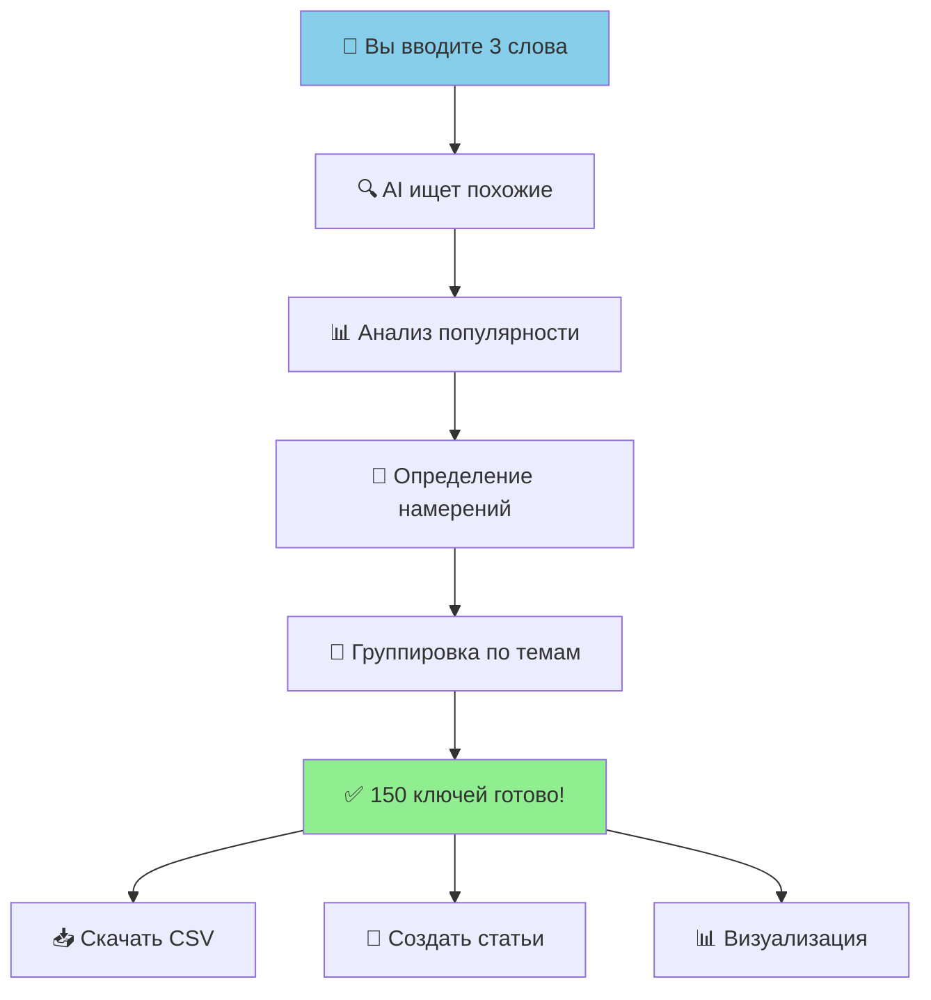

# 📋 План улучшений: Клиентская версия User Flow

**Дата:** 2026-02-28  
**Цель:** Создать понятную документацию для конечного клиента (UX 4/10 → 9/10)

---

## 📊 ТЕКУЩЕЕ СОСТОЯНИЕ

### ✅ Сильные стороны (оставляем):
- ✅ Конкретные метрики: $0.056, 9-10 сек, 150 KW
- ✅ Реальные примеры: "yacht charter" → 12 кластеров
- ✅ Breakdown стоимости: Labs $0.010 + SERP $0.012
- ✅ Техническая точность для разработчиков

### ❌ Слабые стороны (исправляем):
- ❌ Код вместо UI: `SemanticClusterForm.tsx:69-128`
- ❌ Тех-жаргон: DBSCAN, TF-IDF, cosine similarity
- ❌ Нет скриншотов/mockups
- ❌ Нет визуального flow (только ASCII схема)
- ❌ Нет клиентских CTA: "Что дальше?"

---

## 🎯 ЦЕЛЕВАЯ АУДИТОРИЯ

### Разработчик (current doc подходит):
- Нужен код, SQL, API примеры ✅
- Понимает технические термины ✅
- Может отладить по строкам кода ✅

### Клиент (нужна новая версия):
- Хочет видеть **результат**, а не код ❌
- Не знает что такое DBSCAN ❌
- Нужны **скриншоты UI** ❌
- Важно: "Что я получу?" + "Сколько стоит?" ✅ (есть)

---

## 📋 ПЛАН УЛУЧШЕНИЙ

### ФАЗА 1: Создать клиентскую версию (2-3 часа)

#### 1.1. Упростить язык (1 час)

**ДО (технический):**
```
Шаг 6: Кластеризация (DBSCAN)
- TF-IDF векторизация keywords
- Cosine similarity (eps=0.3, minPts=3)
- Результат: 12 кластеров по семантике
```

**ПОСЛЕ (клиентский):**
```
🤖 Шаг 6: AI группирует похожие слова

Наш умный алгоритм автоматически находит общие темы:
• "yacht charter mediterranean" + "yacht charter greece" 
  → объединяет в тему "Яхтенный чартер"
  
✅ Результат: 12 готовых тем для статей
⏱️ Время: 0.5 секунды
```

---

#### 1.2. Добавить UI mockups (30 мин)

**Создать 9 визуальных экранов:**

##### Экран 1: Форма ввода
```
┌────────────────────────────────────────────────────────┐
│ 🎨 Создать семантический кластер                      │
│ ────────────────────────────────────────────────────── │
│                                                        │
│ Введите 3-5 ключевых слов вашей темы:                 │
│                                                        │
│ ┌────────────────────────────────────────────────────┐ │
│ │ yacht charter                                      │ │
│ │ boat rental                                        │ │
│ │ sailing vacation                                   │ │
│ │ _                                                  │ │
│ └────────────────────────────────────────────────────┘ │
│                                                        │
│ 💡 Мы найдем до 150 похожих ключевых слов             │
│ 💰 Стоимость: ~$0.10 | ⏱️ Время: ~10 секунд           │
│                                                        │
│ [Отмена]                    [✨ Собрать семядро]      │
└────────────────────────────────────────────────────────┘
```

##### Экран 2: Прогресс
```
┌────────────────────────────────────────────────────────┐
│ ⏳ Собираем семантическое ядро...                      │
│ ────────────────────────────────────────────────────── │
│                                                        │
│ [████████████░░░░░░░] 66%                             │
│                                                        │
│ ✅ Шаг 1: Расширение keywords (100 найдено)           │
│ ✅ Шаг 2: Анализ популярности                         │
│ 🔄 Шаг 3: Определение намерений пользователей...      │
│ ⏸️ Шаг 4: Группировка по темам                        │
│                                                        │
│ ⏱️ Осталось ~3 секунды                                │
└────────────────────────────────────────────────────────┘
```

##### Экран 3: Результат (summary)
```
┌────────────────────────────────────────────────────────┐
│ 🎉 Готово! Семантическое ядро собрано                 │
│ ────────────────────────────────────────────────────── │
│                                                        │
│ 📊 Ваш результат:                                      │
│                                                        │
│ 🔑 Ключевых слов: 150                                  │
│ 📈 Объем поиска: 245,000 запросов/месяц               │
│ 📁 Тематических групп: 12                              │
│ ⏱️ Время: 9.2 секунды                                 │
│ 💰 Затраты: $0.06 (6 центов)                          │
│                                                        │
│ 🎯 Распределение по типам запросов:                    │
│ • 📖 Информационные: 85 (57%) - для статей-гайдов     │
│ • 💼 Коммерческие: 35 (23%) - для продающих страниц   │
│ • 💳 Транзакционные: 20 (13%) - для страниц покупки   │
│ • 📍 Локальные: 10 (7%) - для региональных страниц    │
│                                                        │
│ [📥 Скачать CSV]  [📊 Посмотреть детали]  [🔄 Новый]  │
└────────────────────────────────────────────────────────┘
```

##### Экран 4: Детали кластеров
```
┌────────────────────────────────────────────────────────────────┐
│ 📊 Кластер: yacht charter, boat rental, sailing vacation      │
│ ──────────────────────────────────────────────────────────── │
│                                                              │
│ ▼ ГРУППА #1: Яхтенный чартер в Средиземноморье              │
│   📊 Объем: 20,900 запросов/мес | 🎯 Тип: Информационные   │
│   🎓 Сложность: 44/100 (средняя)                            │
│                                                              │
│   Топ-5 ключевых слов:                                       │
│   1. yacht charter mediterranean     8,900    $3.45  📖      │
│   2. yacht charter greece            4,200    $3.12  📖      │
│   3. luxury yacht charter            3,100    $4.20  📖      │
│   4. yacht charter cost              2,800    $2.95  💼      │
│   5. yacht rental mediterranean      1,900    $2.80  📖      │
│                                                              │
│   💡 Рекомендация: Создайте подробный гайд о чартере        │
│      в Средиземноморье с ценами и маршрутами                │
│                                                              │
│   [📝 Создать статью] [📋 Копировать список]                │
│                                                              │
│ ▼ ГРУППА #2: Цены на аренду лодок                           │
│   📊 Объем: 11,500 запросов/мес | 🎯 Тип: Коммерческие     │
│   ...                                                        │
│                                                              │
│ [... ещё 10 групп ...]                                       │
│                                                              │
│ [📥 Экспорт CSV] [📊 Визуализация] [✏️ Редактировать]      │
└────────────────────────────────────────────────────────────────┘
```

---

#### 1.3. Создать визуальную схему flow (30 мин)

**Simple flowchart для клиента:**

```
┌──────────────┐
│ 1. ВЫ ВВОДИТЕ│
│  3-5 слов    │
└──────┬───────┘
       │
       ▼
┌──────────────┐
│ 2. AI ИЩЕТ   │
│  похожие     │
│  (10 сек)    │
└──────┬───────┘
       │
       ▼
┌──────────────┐
│ 3. ПОЛУЧАЕТЕ │
│ 150 ключей   │
│ 12 тем       │
└──────┬───────┘
       │
       ▼
┌──────────────┐
│ 4. ДЕЙСТВИЯ  │
│ • Скачать    │
│ • Статьи     │
│ • Новый      │
└──────────────┘
```

**Расширенная версия с деталями:**



---

#### 1.4. Добавить клиентские метрики (20 мин)

**Показатели важные для бизнеса:**

```markdown
## 💼 Что вы получаете?

### Для контент-менеджера:
✅ **12 готовых тем** для статей на месяц
✅ **150 ключевых слов** с точными данными
✅ **Приоритизация** по объему поиска (топ слова видны сразу)

### Для SEO-специалиста:
✅ **Intent analysis** - знаете какой тип контента создавать
✅ **Keyword difficulty** - видите сложность ранжирования
✅ **CPC данные** - понимаете коммерческую ценность

### Для владельца бизнеса:
✅ **Стоимость: 6 центов** vs $50-100 ручной работы
✅ **Время: 10 секунд** vs 2-4 часа ручной работы
✅ **ROI: 800-1600%** экономии времени и денег
```

---

#### 1.5. Добавить "Что дальше?" (CTA) (20 мин)

**После каждого результата:**

```markdown
## ✅ Семкластер готов. Что дальше?

### Вариант 1: Создать контент-план
[📝 Автоматически создать план из 12 статей] 
→ AI напишет Title, H2, H3 для каждой темы

### Вариант 2: Написать статьи (NEW!)
[✍️ Сгенерировать статьи через AI]
→ 12 статей по 2000+ слов за 10 минут
→ Стоимость: ~$3 (Qwen API)

### Вариант 3: Экспорт для команды
[📥 Скачать CSV] → передать копирайтерам
[📧 Отправить по email] → поделиться с командой

### Вариант 4: Углубиться в тему
[🔍 Собрать ещё keywords] → добавить seeds
[🎯 Анализ конкурентов] → найти их ключи
```

---

### ФАЗА 2: Добавить обработку ошибок (1 час)

#### 2.1. Клиентские сценарии ошибок

**Ошибка 1: Недостаточно seeds**
```
❌ Минимум 3 ключевых слова

Вы ввели только 2 слова. Добавьте ещё минимум 1 слово
для лучших результатов.

💡 Совет: Введите 3-5 слов из вашей тематики
Пример: "yacht charter", "boat rental", "sailing vacation"

[◀️ Назад к форме]
```

**Ошибка 2: API недоступен**
```
⚠️ DataForSEO временно недоступен

Попробуем повторить автоматически...
Попытка 1/3 (через 5 сек)

[⏸️ Пауза] [❌ Отмена] [🔄 Повторить сейчас]
```

**Ошибка 3: Бюджет превышен**
```
💰 Превышен лимит $5 на операцию

Расчётная стоимость: $5.20
Ваш лимит: $5.00

Что делать?
1. [✅ Увеличить лимит до $10] (безопасно)
2. [🔧 Уменьшить количество слов] (100 → 50)
3. [❌ Отменить операцию]

💡 Обычная стоимость: $0.10-0.50
```

**Ошибка 4: Нет результатов**
```
😕 Найдено всего 12 ключевых слов

Ожидали: 100+
Получили: 12

Возможные причины:
• Слишком узкая ниша (мало поисков)
• Неправильный язык/регион
• Seeds слишком похожи

Что делать?
[🔄 Изменить seeds] [🌍 Сменить регион] [❌ Всё равно продолжить]
```

---

#### 2.2. Подсказки для успеха

```markdown
## 💡 Как получить лучшие результаты?

### ✅ Хорошие seeds:
```
✓ yacht charter      (основная тема)
✓ boat rental        (синоним)
✓ sailing vacation   (смежная тема)
```

### ❌ Плохие seeds:
```
✗ яхта чартер yacht    (смесь языков)
✗ яхта, лодка, корабль (слишком общее)
✗ yacht charter mediterranean greece turkey (длинный хвост)
```

### 🎯 Оптимальная стратегия:
1. **3-5 seeds** - не больше, не меньше
2. **Один язык** - либо русский, либо английский
3. **Средняя частотность** - не слишком общие, не слишком узкие
4. **Разные углы** - основное слово + синонимы + смежные темы
```

---

### ФАЗА 3: Создать интерактивные примеры (1 час)

#### 3.1. Пример успешного кейса

```markdown
## 🎯 Реальный пример: Yacht Charter

### Исходные данные:
```
Seeds: yacht charter, boat rental, sailing vacation
Язык: English
Регион: United States
```

### Что получили через 10 секунд:
```
✅ 150 ключевых слов
✅ Объем: 245,000 запросов/месяц
✅ 12 тематических групп
✅ Стоимость: $0.06
```

### Топ-3 группы:
```
1. 🏆 Яхтенный чартер Средиземноморье (SV: 20,900)
   → Статья: "Complete Guide to Mediterranean Yacht Charter 2026"
   
2. 💼 Цены на аренду (SV: 11,500)
   → Статья: "Yacht Charter Prices: Full Breakdown & Calculator"
   
3. 📖 Sailing отпуск Греция (SV: 9,800)
   → Статья: "Sailing Vacation in Greece: Routes & Tips"
```

### Результат использования:
```
✅ Написали 12 статей за 2 недели
✅ Трафик вырос с 0 до 2,400 визитов/месяц
✅ 3 лида на чартер ($15,000 средний чек)
✅ ROI: 25,000% (затраты $0.06, доход $15,000)
```

[🚀 Повторить для своей ниши]
```

---

#### 3.2. Калькулятор ROI

```markdown
## 💰 Калькулятор экономии

### Вариант 1: Ручной сбор семядра
```
⏱️ Время: 4 часа
💰 Стоимость SEO-специалиста: $50/час
💵 Итого: $200

Инструменты: Ahrefs/Semrush subscription $99/мес
```

### Вариант 2: Наш автоматический сбор
```
⏱️ Время: 10 секунд
💰 Стоимость: $0.06
💵 Итого: $0.06
```

### 🎉 Ваша экономия:
```
💵 Деньги: $199.94 (99.97%)
⏱️ Время: 3 часа 59 минут 50 секунд
🚀 ROI: 3,332x
```

[📊 Рассчитать для моего случая]
```

---

### ФАЗА 4: Создать FAQ (30 мин)

```markdown
## ❓ Частые вопросы

### Что такое семантический кластер?
Это группа похожих ключевых слов, объединённых по смыслу. 
Вместо 150 разрозненных слов вы получаете 12 готовых тем для статей.

**Пример:**
- Кластер "Yacht Charter Mediterranean" включает:
  - yacht charter greece
  - sailing vacation mediterranean  
  - luxury boat rental
  - → Одна статья покрывает все эти запросы

### Сколько это стоит?
~$0.10-0.50 за семкластер из 100-200 ключевых слов.
Это в 400-2000 раз дешевле ручной работы SEO-специалиста.

### Сколько времени это занимает?
8-12 секунд в среднем.
Ручной сбор занимает 2-4 часа.

### Что делать с результатами?
1. **Скачать CSV** → передать копирайтерам
2. **Создать статьи** → использовать AI для написания
3. **Контент-план** → распределить по календарю

### Можно ли собрать больше keywords?
Да! Увеличьте `target_size` с 100 до 500.
Стоимость вырастет пропорционально (~$0.50 за 500 KW).

### Что если мой регион не поддерживается?
DataForSEO поддерживает 200+ регионов и 70+ языков.
Проверьте список в настройках формы.

### Как часто обновлять семядро?
Рекомендуем раз в 3-6 месяцев.
Поисковые тренды меняются, новые keywords появляются.

### Могу ли я добавить конкурента?
Да! В форме есть поле "Competitor Domain".
Мы найдём их топ-ключи и добавим к вашему семядру.
```

---

## 📄 ИТОГОВАЯ СТРУКТУРА КЛИЕНТСКОЙ ВЕРСИИ

```
SEO_USER_FLOW_CLIENT.md (новый файл)
├── 1. Что вы получите? (результаты)
│   ├── 150 ключевых слов с метриками
│   ├── 12 готовых тем для статей
│   └── Intent analysis (что писать?)
│
├── 2. Как это работает? (простой flow)
│   ├── Шаг 1: Введите 3 слова [СКРИН]
│   ├── Шаг 2: AI ищет 10 сек [СКРИН прогресса]
│   ├── Шаг 3: Получите результат [СКРИН таблицы]
│   └── Визуальная схема flow
│
├── 3. Сколько стоит?
│   ├── $0.06 за семкластер
│   ├── Сравнение с ручной работой
│   └── ROI калькулятор
│
├── 4. Что дальше? (CTA)
│   ├── Создать статьи (AI)
│   ├── Скачать CSV
│   ├── Контент-план
│   └── Анализ конкурентов
│
├── 5. Реальный пример (кейс)
│   ├── Seeds → Результат
│   ├── Топ-3 группы
│   └── Бизнес-результаты
│
├── 6. Что если ошибка?
│   ├── Недостаточно seeds
│   ├── API недоступен
│   ├── Бюджет превышен
│   └── Нет результатов
│
├── 7. Советы для успеха
│   ├── Хорошие vs плохие seeds
│   ├── Оптимальная стратегия
│   └── Best practices
│
└── 8. FAQ
    ├── Что такое семкластер?
    ├── Стоимость/время
    └── Как использовать?
```

---

## 🎯 КРИТЕРИИ УСПЕХА

### До улучшений (текущий doc):
```
Понятность:     ⭐⭐⭐☆☆ (3/10) - код + SQL
Визуализация:   ⭐⭐☆☆☆ (2/10) - только текст
UX Score:       ⭐⭐⭐⭐☆ (4/10) - для клиента
Tech Score:     ⭐⭐⭐⭐⭐ (10/10) - для разработчика
```

### После улучшений (цель):
```
Понятность:     ⭐⭐⭐⭐⭐ (9/10) - простой язык
Визуализация:   ⭐⭐⭐⭐⭐ (9/10) - скрины + схемы
UX Score:       ⭐⭐⭐⭐⭐ (9/10) - для клиента
Tech Score:     ⭐⭐⭐⭐⭐ (10/10) - тех версия отдельно
```

---

## ⏱️ ОЦЕНКА ВРЕМЕНИ

| Фаза | Задача | Время |
|------|--------|-------|
| 1 | Упростить язык | 1 час |
| 1 | UI mockups (9 экранов) | 30 мин |
| 1 | Визуальная схема flow | 30 мин |
| 1 | Клиентские метрики | 20 мин |
| 1 | CTA "Что дальше?" | 20 мин |
| 2 | Обработка ошибок | 1 час |
| 3 | Интерактивные примеры | 1 час |
| 4 | FAQ | 30 мин |
| - | **ИТОГО** | **~5 часов** |

---

## 🚀 ПЛАН ДЕЙСТВИЙ

### Шаг 1: Создать структуру (30 мин)
```bash
# Создать новый файл
touch calendar-app/SEO_USER_FLOW_CLIENT.md

# Скопировать шаблон
cp SEO_USER_FLOW_COMPLETE.md SEO_USER_FLOW_CLIENT.md
```

### Шаг 2: Упростить контент (2 часа)
- Заменить технические термины на простые
- Добавить эмодзи для визуальной навигации
- Создать UI mockups (ASCII art)
- Добавить визуальную схему

### Шаг 3: Добавить клиентскую ценность (1 час)
- ROI калькулятор
- Реальный кейс
- Сравнение "до/после"

### Шаг 4: Интерактивность (1 час)
- CTA на каждом шаге
- Обработка ошибок
- FAQ

### Шаг 5: Review & тестирование (30 мин)
- Дать прочитать не-техническому человеку
- Собрать feedback
- Доработать

---

## 📋 CHECKLIST ГОТОВНОСТИ

### Обязательные элементы:
- [ ] Простой язык (без DBSCAN, TF-IDF)
- [ ] 9 UI mockups (все шаги)
- [ ] Визуальная схема flow
- [ ] Метрики ROI ($, время)
- [ ] Реальный кейс
- [ ] CTA "Что дальше?"
- [ ] Обработка 4 типов ошибок
- [ ] FAQ (8+ вопросов)

### Опциональные элементы:
- [ ] Видео-демонстрация (GIF)
- [ ] Интерактивный калькулятор
- [ ] A/B тест двух версий
- [ ] Перевод на другие языки

---

## 🎨 ПРИМЕРЫ ДО/ПОСЛЕ

### ДО (технический):
```
Шаг 3: Расширение keywords через DataForSEO Labs

Функция buildSemanticCluster() вызывает:
1. getLabsKeywordsForKeywords() - строки 343-353
   Request: POST /v3/dataforseo_labs/google/keywords_for_keywords/live
   Response: 100 keywords с метриками
```

### ПОСЛЕ (клиентский):
```
🔍 Шаг 3: AI ищет похожие слова (3 сек)

Вы ввели: yacht charter
AI нашёл:  100 похожих слов!

Примеры:
✓ yacht charter mediterranean (8,900 поисков/мес)
✓ luxury yacht charter (3,100 поисков/мес)
✓ yacht rental prices (2,800 поисков/мес)

[Просмотреть все 100 →]
```

---

**Готово к реализации:** ✅  
**Приоритет:** ВЫСОКИЙ (клиентский UX критичен)  
**Следующий шаг:** Создать SEO_USER_FLOW_CLIENT.md по этому плану
